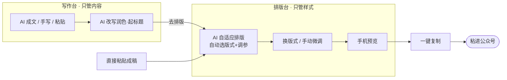
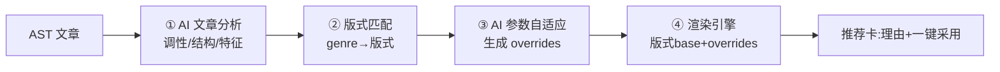

# 微信公众号 AI 写作排版工具 — 设计文档
### （个人自用 · 精致体验版 v3.0）

> 交付对象：开发者，可据此直接开发。
> 定位：**个人自用**、本地运行、追求好用；不做商业化（无备案/认证/合规/计费/多用户/团队）。

---

## 0. 修订说明（v2 → v3 变更）

本次升级围绕三个核心诉求，请重点看第 **5 / 6** 章：

| # | 变更 | 涉及章节 |
|---|---|---|
| 1 | **写作与排版彻底拆开**：分成「写作台」和「排版台」两个独立模块，排版功能可独立使用（排版别处写的稿也行） | §2 §4 §5 |
| 2 | **版式系统重构**：从"只换颜色"升级为"整套版式设计"——标题/金句/列表/分隔/装饰/节奏/配色多维差异，内置 8 套风格迥异版式 | §6 |
| 3 | **新增 AI 自适应排版**：AI 读懂文章调性，自动挑版式并微调参数，不是简单套模板 | §7 |

---

## 1. 产品目标与体验原则

**目标**：想写时 AI 帮你写好一篇干净的稿；想排时，把任意稿子交给它，AI 看懂文章调性、自动排出**风格贴合**的精致版面，你再随手微调，一键复制进公众号。

**六条体验原则**：
1. **写归写、排归排**：写作和排版是两种心智，分开做更专注，也让排版能独立复用。
2. **AI 懂你的文章**：排版不是"套个模板"，而是 AI 根据文章是干货/情感/资讯…自动选版式、调参数。
3. **版式有真差异**：每套版式是完整的视觉语言（结构+装饰+配色），不是同一套样式换个色。
4. **所见即所得**：编辑与手机预览实时一致，绝不"复制过去变样"。
5. **绝不丢格式**：复制到公众号 100% 保留排版（内联样式），工程红线。
6. **即开即用**：本地一个应用，双击打开，不折腾环境、不备案。

---

## 2. 功能范围（IN / OUT）

### ✅ 做（IN）

**模块 A · 写作台（只管内容）**
| 功能 | 说明 |
|---|---|
| AI 成文 | 主题/大纲 → 一篇结构清晰的稿（纯内容，不含视觉设计） |
| 选中即改 | 选中→改写/润色/扩写/精简/续写/换风格 |
| 起标题 / 摘要 | 多个标题候选、一键导语 |
| 手写 / 粘贴 | 直接写，或粘贴已有文章（Word/网页自动清洗） |

**模块 B · 排版台（只管样式）**
| 功能 | 说明 |
|---|---|
| **AI 自适应排版** | AI 分析文章调性 → 自动选版式 + 微调参数（核心，§7） |
| 版式库 | 8 套结构迥异的版式，一键切换（§6） |
| 局部微调 | 块级样式、主题色、字号、间距、装饰元素开关 |
| 样式组件 | 金句框、引导关注卡、序号卡、分割线等 |
| 手机预览 | 375px 真机，含深色模式 |
| 一键复制 | 内联样式 HTML，粘进公众号保留排版 |
| 存我的版式 | 把调好的版式存成自定义版式 |

**通用**：本地草稿自动保存、草稿列表、图片拖拽插入。

### ❌ 不做（OUT，个人自用）
登录/多用户、云账号、备案/认证、AI 合规登记、内容审核、计费、团队协作、数据后台。

---

## 3. 核心架构理念（内容与样式分离 —— 也是"写排分离"的地基）

```
【写作台】产出 → 结构化文档(AST)    ← 只有"这是标题/金句/列表"，无任何视觉
                        │  交接
                        ▼
【排版台】AST + 版式(Style) → 渲染引擎 → 微信内联样式 HTML
                 ▲
        AI 自适应：读 AST → 选版式 + 调参数
```

- **写作只生产内容(AST)**，排版只生产样式，两者通过 AST 解耦——这正是"写排能分开、排版能独立复用、AI 能自适应"的根本。
- 换版式/AI 重排/手动微调，都只在"样式层"发生，内容(AST)一字不动。

> 请开发**先把 AST 与 版式(Style) 两套结构定死**（§8.3），再动界面。

---

## 4. 用户流程（写排分离后的主线）



**三个入口**：① 写作台写完 →「去排版」；② 直接进排版台**粘贴/导入**成稿；③ 打开旧草稿继续。写作台与排版台是**两个独立界面**，互不干扰。

---

## 5. 界面设计

### 5.1 两个主界面（对应写排分离）

**① 写作台**——像一个干净的写作软件，专注文字，**没有任何排版/模板元素**：
- 中间大面积写作区（块编辑，纯净排版：只有黑字白底、清晰层级）。
- 左侧 AI 面板：主题成文、字数/风格。
- 选中文字浮现工具条：加粗 / ✨改写 / 润色 / 扩写…。
- 右上：字数、`去排版 →`（把当前 AST 交给排版台）。

**② 排版台**——三栏设计工具：
```
┌───────────────────────────────────────────────────────┐
│ 顶栏：草稿名 · 已保存 · [AI 智能排版] [复制到公众号]     │
├──────────────┬─────────────────────────┬──────────────┤
│ 左：版式库    │   中：可视化版面(所见即所得) │ 右：手机预览  │
│ + AI 推荐    │                          │ + 微调面板    │
└──────────────┴─────────────────────────┴──────────────┘
```

### 5.2 写作台 · 交互
块编辑（Tiptap）、斜杠 `/` 插入结构、选中浮动工具条唤起 AI、智能粘贴清洗、撤销重做、快捷键。**输出永远是纯内容 AST**，不掺样式。

### 5.3 排版台 · AI 自适应排版（入口交互）
进入排版台或点顶栏「AI 智能排版」时：
1. 出现分析动效："正在读懂这篇文章…"（分析调性/结构，§7）。
2. 给出推荐卡：
   > **AI 已为《三个早起技巧》选用【干货清单】版式**
   > 理由：这是一篇结构清晰的方法类干货，含 3 组要点。
   > 已适配：要点转为序号卡片 · 重点色块高亮 · 配色偏冷静蓝。
   > `[采用]` `[换一个风格]` `[我自己挑]`
3. 采用后直接渲染；「换一个」在推荐序列里循环；「我自己挑」展开版式库。

### 5.4 排版台 · 版式库（左栏）
- 8 套版式**缩略图**（真实版面缩略，不是色块），一眼看出结构差异。
- AI 推荐的那套顶部高亮标注「AI 推荐」。
- 点选即整篇重排，**带过渡动画**，且**保留用户手动改过的块**（override 不丢）。

### 5.5 排版台 · 微调面板（右栏，选中块时）
- 全局：主题色、正文字号、行距、段间距、内容边距。
- 装饰开关：分割线样式、段落装饰、页眉页尾卡（随版式提供的可选项）。
- 块级 override：选中某块 → 改其字号/色/对齐/背景/间距，优先级高于版式，可「恢复默认」。
- **存为我的版式**：把当前版式+参数存成命名版式。

### 5.6 手机预览（右栏）
375px 真机、明/暗切换、与版面同源渲染。

---

## 6. 版式系统（重点 · 解决"样式单一"）

### 6.1 核心思想：版式 = 一套完整视觉语言，不是一个颜色

一套**版式(Style Preset)** 由多个维度共同定义，颜色只是其中之一：

| 维度 | 包含什么 |
|---|---|
| 配色 palette | 主色 / 辅色 / 背景底色 / 正文色 / 强调色 |
| 排印 typography | 标题字号字重、层级比例、行距、字间距、是否首字下沉、衬线感 |
| 节奏 rhythm | 段间距、段落对齐、内容边距、整体留白密度 |
| 组件 components | 标题/金句/列表/强调/图片/分隔 各自的**样式变体** |
| 装饰 decorations | 页眉页尾装饰、段落序号/图标、分段小饰件 |

**组件级"变体库"**（版式就是从这些变体里组合出来的，可组合出无穷多风格）：
- **标题变体**：居中衬线 / 色块底 / 数字徽章 / 下划色线 / 图标前缀 / 竖线书法感
- **金句变体**：大引号卡片 / 色块便签 / 居中大字 / 左竖线淡底 / 手写波浪框
- **列表变体**：序号圆圈 / 图标勾选 / 卡片项 / 简约圆点 / 竖条时间线
- **分隔变体**：波浪线 / 圆点线 / 文字标签("· 正文 ·") / 渐变细线 / 图标居中
- **强调变体**：荧光底色 / 下划波浪 / 主色加粗 / 方框
- **装饰变体**：页眉小图标条 / 页尾引导关注卡 / 段首装饰符

### 6.2 内置 8 套版式（结构迥异，非换色）

| 版式 | 结构特征（一眼区别） | 适合调性 |
|---|---|---|
| **杂志随笔** | 居中大标题 · 首字下沉 · 宽留白 · 细灰线分隔 · 图注小字 | 情感 / 观点 / 故事 |
| **干货清单** | 数字徽章小标题 · 要点做成卡片 · 重点色块高亮 · 强结构 | 教程 / 盘点 / 方法论 |
| **轻松社交** | 圆角气泡引用 · 活泼撞色 · 短段 · 圆点分隔 · 友好 | 日常 / 种草 / 随聊 |
| **商务简报** | 左侧色条标题 · 灰底信息块 · 克制配色 · 对齐工整 | 职场 / 行业 / 通知 |
| **走心温暖** | 柔和暖底 · 居中排版 · 大金句居中放大 · 波浪分隔 · 极多留白 | 情感 / 治愈 / 节日 |
| **知识科普** | 图标前缀标题 · 步骤条/序号流程 · 术语高亮框 · 信息卡 | 科普 / 解释 / 教程 |
| **极简克制** | 无彩色装饰 · 纯黑灰 · 大字重对比 · 大留白 · 几乎无分隔线 | 深度长文 / 高级感 |
| **国风雅致** | 衬线标题 · 朱红点缀 · 竖线/印章装饰 · 米色底 · 引号书法感 | 文化 / 传统 / 文艺 |

> 每套都在"标题/金句/列表/分隔/装饰/节奏/配色"上真正不同。开发时它们不是 8 段写死 CSS，而是**从 6.1 的变体库组合而成**，便于扩展与 AI 调参。

### 6.3 手机预览缩略图要点
版式库里每套用**真实版面缩略图**（拿一段样例文渲染后缩小），让用户"看结构"而非"看色块"，这是选版式体验的关键。

---

## 7. AI 自适应排版（重点 · 让 AI 懂文章）

### 7.1 目标
用户不用懂排版。AI 读完文章，自动判断"这该长什么样"，选出最贴合的版式并**针对这篇文章微调参数**——干货就强化结构、情感就加大留白居中、金句多就放大金句。

### 7.2 流水线（四步）



**① 文章分析（AI）**——输出结构化标签：
```json
{
  "genre": "干货",            // 情感/故事/干货/教程/资讯/职场/科普/文化
  "tone": "冷静专业",
  "hasList": true,            // 是否清单体
  "strongQuotes": 2,         // 金句数量
  "avgParaLen": 65,          // 平均段长
  "length": "中",
  "keywords": ["早起","习惯"]
}
```

**② 版式匹配**——genre/tone → 版式（规则表兜底，AI 可覆盖）：
| genre | 首选版式 | 备选 |
|---|---|---|
| 情感 / 故事 | 杂志随笔 | 走心温暖 |
| 干货 / 教程 / 盘点 | 干货清单 | 知识科普 |
| 科普 / 解释 | 知识科普 | 干货清单 |
| 资讯 / 职场 | 商务简报 | 极简克制 |
| 日常 / 种草 | 轻松社交 | 杂志随笔 |
| 深度 / 文化 | 极简克制 / 国风雅致 | 杂志随笔 |

**③ 参数自适应（AI/规则）**——针对本文特征生成 overrides：
- 金句多 → `quote.variant = 居中大字` 且放大；
- 清单体 → `list.variant = 序号卡片`；
- 情感 & 段落短 → `rhythm.align = 居中`、`paragraphGap` 加大、`palette` 调暖；
- 干货长文 → 收紧行距、强调用色块高亮、每节加数字徽章。

**AI 返回契约**（一个 JSON，渲染引擎照用）：
```json
{
  "styleId": "listicle_cards",
  "reason": "结构清晰的方法类干货，含 3 组要点，适合强结构卡片版式。",
  "overrides": {
    "list.variant": "number-circle-card",
    "emphasis.variant": "highlight-bg",
    "palette.primary": "#2B6CB0",
    "rhythm.paragraphGap": "16px"
  }
}
```

**④ 渲染** = 版式 base（6.1）合并 overrides → 内联 HTML；**规则兜底**：分析或 JSON 失败 → 回退默认版式，绝不崩。

### 7.3 与手动的关系（三层，用户始终可控）
```
版式库(设计词汇)  →  AI 自适应(自动选+调参)  →  用户手动微调(override)
                     ↑ 可「换一个/我自己挑」      ↑ 可「恢复默认」
```
AI 给基线，用户永远能推翻或微调；两者不冲突。

---

## 8. 技术方案

### 8.1 架构（本地优先）
推荐打包成**桌面 App（Tauri 首选 / Electron）**，双击即用，无需终端、无需备案。
- 前端 SPA：写作台 + 排版台两个路由。
- 本地核心：代理 LLM（避 CORS、藏 Key）、跑渲染引擎与 AI 排版流水线、本地存储。
- 存储：SQLite 或本地文件（草稿/版式/图片/设置）。
- 备选：本地 Web 服务 + 浏览器 localhost（功能等价，启动要跑一条命令）。

### 8.2 技术选型
| 层 | 选型 | 理由 |
|---|---|---|
| 前端 | React + TS + Vite | 快、生态好 |
| 编辑器 | **Tiptap(ProseMirror)** | 块编辑，JSON 即 AST，全项目最关键选型 |
| 样式 | Tailwind / 内联 | — |
| 本地核心 | Tauri(Rust) 命令 / Node 轻服务 | 代理 + 存储 + 渲染 |
| 存储 | SQLite / JSON | 个人量级零配置 |
| LLM | OpenAI 兼容（DeepSeek/Kimi/通义），流式 | 一套代码通吃 |
| 打包 | **Tauri** / Electron | 双击即用 |

### 8.3 数据模型

**文档 AST（写作台产出，Tiptap JSON 可直接承载）**：
```json
{
  "meta": { "title": "标题", "digest": "摘要" },
  "blocks": [
    { "id":"b1", "type":"title",   "text":"主标题", "style":{} },
    { "id":"b2", "type":"heading", "text":"小标题", "style":{} },
    { "id":"b3", "type":"paragraph","runs":[{"text":"正文"},{"text":"重点","marks":["bold"]}], "style":{} },
    { "id":"b4", "type":"quote",   "text":"金句", "style":{} },
    { "id":"b5", "type":"list", "ordered":false, "items":["要点一","要点二"] },
    { "id":"b6", "type":"image", "src":"...", "caption":"图注", "style":{} },
    { "id":"b7", "type":"divider" }
  ]
}
```

**版式 Style Preset（排版台使用，扩展版 —— 支撑"多维差异 + AI 调参"）**：
```json
{
  "id": "listicle_cards",
  "name": "干货清单",
  "moods": ["干货","教程","盘点"],
  "palette": { "primary":"#2B6CB0","secondary":"#E8F0FB","bg":"#FFFFFF","textMain":"#2f3338","textSub":"#8a8f98","accent":"#2B6CB0" },
  "typography": { "titleSize":"22px","h2Size":"17px","bodySize":"15px","lineHeight":1.85,"letterSpacing":"0.4px","firstLetterDrop":false },
  "rhythm": { "paragraphGap":"16px","sectionGap":"26px","contentPadding":"0 2px","align":"left" },
  "components": {
    "title":     { "variant":"block" },
    "heading":   { "variant":"number-badge" },
    "quote":     { "variant":"card" },
    "list":      { "variant":"number-circle-card" },
    "emphasis":  { "variant":"highlight-bg" },
    "divider":   { "variant":"dot-line" },
    "image":     { "variant":"rounded-shadow" }
  },
  "decorations": { "header":null, "footer":"follow-card", "sectionOrnament":"number" }
}
```
> 用户 override 与 AI overrides 都是对这个对象的**局部字段覆盖**（如 `list.variant`、`palette.primary`）。渲染引擎按 `版式 base → AI overrides → 用户 override` 三级合并。

**本地表**：`draft`(内容AST)、`draft_version`、`style_preset`(系统+自定义)、`asset`、`setting`。

### 8.4 渲染引擎（微信内联样式兼容 · 第一红线）
- 输入 AST + 合并后的版式对象 → 每个块按其组件 variant 生成 **inline `style`** 字符串（不用 class）。
- 每个 variant 是一个"渲染函数"：给定内容 + palette/typography/rhythm，吐出内联 HTML 片段。**8 套版式复用同一批 variant 渲染器**，只是配置不同——这样加版式=配 JSON，不是写死 CSS。
- 预览与复制**共用同一份渲染输出**。

### 8.5 AI 集成
- OpenAI 兼容 `chat/completions`，本地核心代理（避 CORS、藏 Key）。
- 三类调用：**写作**（成文/改写）、**文章分析**（输出 §7.2 标签）、**参数自适应**（输出 overrides JSON）。分析/自适应可用性价比模型控成本。
- 所有 JSON 输出都要**Schema 校验 + 规则兜底**。

### 8.6 复制与图片
- 复制走 `text/html`，`execCommand` 兜底。
- 图片拖拽/粘贴 → 本地托管拿 URL；提示可在公众号后台补图最稳。

---

## 9. 微信兼容红线（贴墙上）
1. 只用**内联 `style`**，禁用 class / `<style>` / 外链 CSS / `<script>`。
2. 标签白名单：`section/p/span/strong/em/img/br/a`；慎用表格，禁 flex/grid/position。
3. 复制走 `text/html` + `execCommand` 兜底。
4. 图片用可公开访问 URL，必要时引导公众号后台补图。
5. 预览与复制**同源渲染**，杜绝"预览好看、粘过去变样"。

---

## 10. 开发路线

- **M1 · 写排闭环（核心）**
  写作台(Tiptap 纯内容) + 排版台三栏 + 渲染引擎(variant 化) + **先做 4 套差异明显的版式** + 手机预览 + 一键复制 + AI 成文 + 本地保存。
  → 目标：写完/贴稿 →「去排版」→ 选版式 → 30 秒得到可复制精致版面。

- **M2 · AI 自适应 + 版式扩充**
  AI 文章分析 + 版式匹配 + 参数自适应（§7 全流程）+ 补齐到 8 套版式 + 组件变体库 + 手动微调面板 + 存自定义版式 + 选中即改/起标题。

- **M3 · 打磨加分**
  Tauri/Electron 桌面打包 + 样式组件(引导关注卡/序号卡) + 草稿版本历史 + 智能粘贴清洗 + 深色预览 + 快捷键 + 崩溃恢复。

---

## 11. 给程序员的落地建议
1. **先定 AST 与 版式(Style) 两套 JSON**，且版式用 **6.1 的变体组合式**结构——这是"多版式 + AI 调参"能成立的前提。
2. **variant 渲染器化**：把标题/金句/列表/分隔等各变体写成独立渲染函数，版式=配置组合；加版式=配 JSON。
3. **写作台与排版台两个路由**，靠 AST 交接，互不耦合。
4. **AI 三类调用都要 Schema 校验 + 规则兜底**，绝不因模型返回异常而崩。
5. **渲染引擎独立**，预览与复制共用同一份内联 HTML。
6. 版式**宁精勿滥**：M1 先做 4 套但要"结构上真的不一样"，胜过 20 套换色。
7. AI 自适应先用**规则表**保底（genre→版式映射），再叠加 AI 覆盖，稳且省。

---

*本文档聚焦个人自用与体验。接口细节以微信公众平台与所选大模型最新官方文档为准。*
